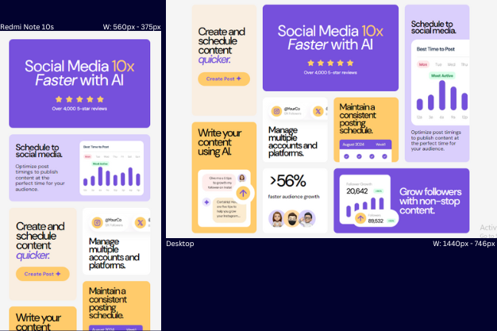
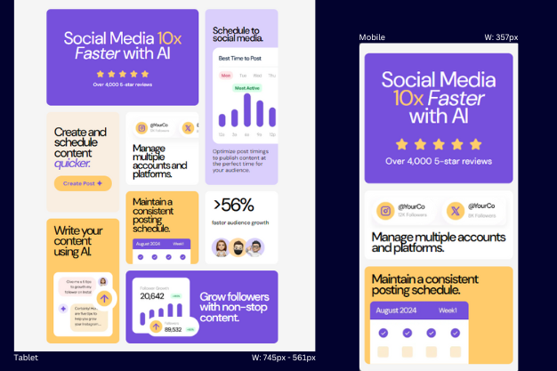

# Frontend Mentor - Bento grid solution

This is a solution to the [Bento grid challenge on Frontend Mentor](https://www.frontendmentor.io/challenges/bento-grid-RMydElrlOj).

## Table of contents

- [Overview](#overview)
  - [The challenge](#the-challenge)
  - [Screenshot](#screenshot)
  - [Links](#links)
  - [Tech Stack](#tech-stack)
  - [What I learned](#what-i-learned)
- [Developer](#developer)

## Overview

### 💥 The challenge

Users should be able to:

- View the optimal layout for the interface depending on their device's screen size

### 📷 Screenshot

### 🔗 Links

  

### ⚙ Tech Stack

- HTML5
- GridCSS
- SASS
- Flexbox
- JavaScript

### 📝 What I learned

My mojor learning from this project was how to use grid to create attractive layouts. Using grid, I was also able to create a responsive page that adjusted according to screen width by manipulating the arrangement of cards and numbers of rows and columns available within a pair of breakpoints. Flexbox also came in very handy for arranging the elements inside the cards to achieve the desired look. In future projects I will improve on using flexbox to properly size and arrange elements without much reliance on hard-coded values.

## 👩‍💻 Develope

 
